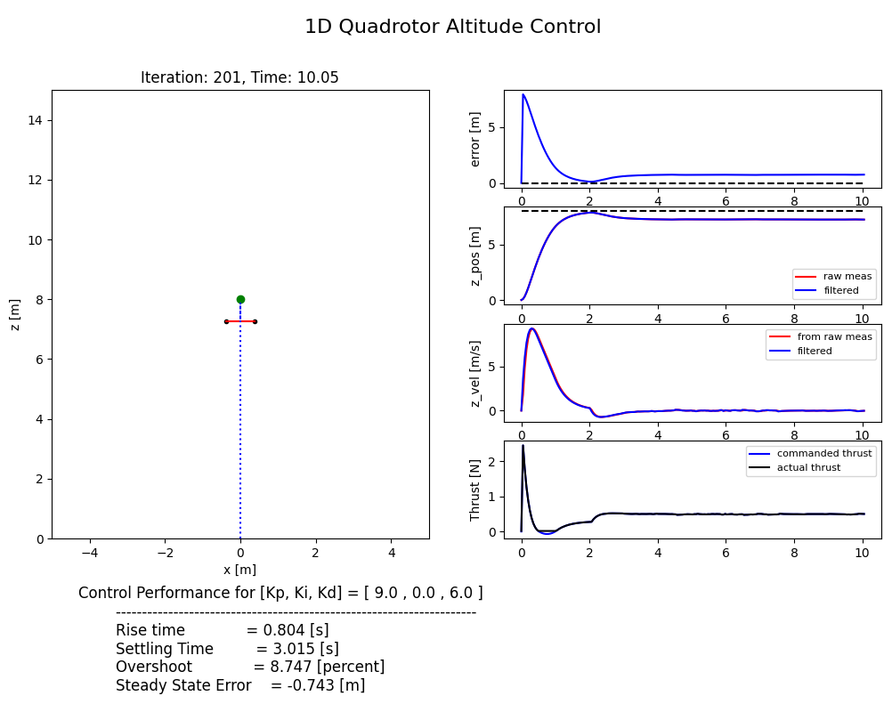
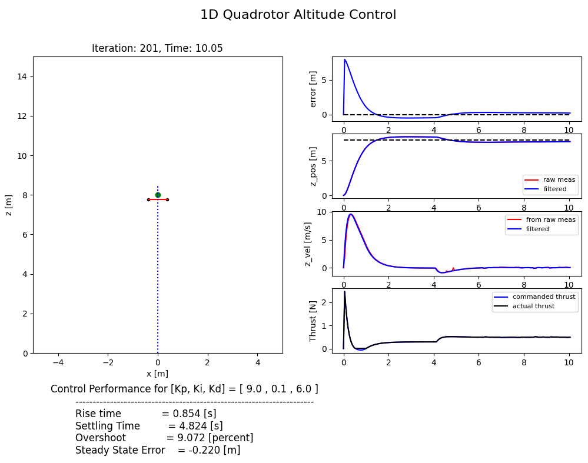
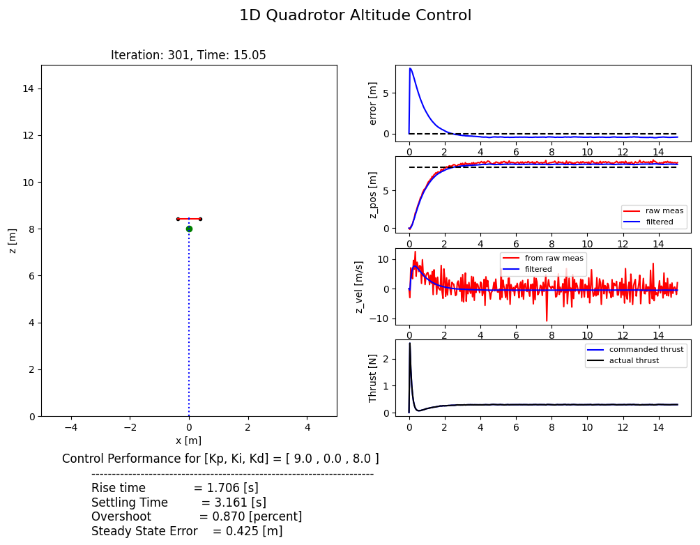
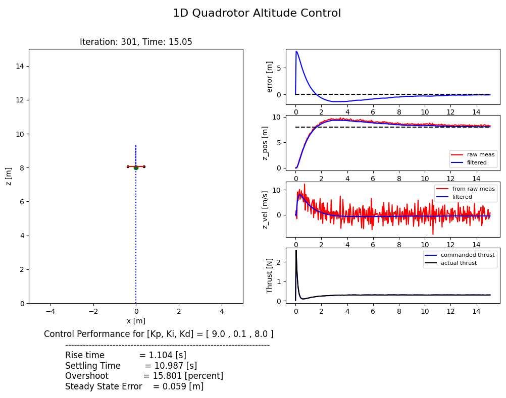

# 1D Crazyflie Altitude Control
Rajiv Perera & Allison Li

# Part 1: Controller
To achieve the goal-criteria as closely as possible we increased the positive thrust limit located in the `utils.py` to 50x the force of gravity rather than 2.5x. We did not alter the minimum thrust, as this would have made the controller unrealistic (the propellers on the quadrotor cannot provide negative thrust). 

Implementing the controller class was done in the `Controller.py` file. 
```
    def compute_commands(self, setpoint, state):
        """
        Inputs:
        - setpoint (State dataclass):   the desired control setpoint
        - state (State dataclass):      the current state of the system

        Returns:
        - U (float): total upward thrust
        """
        # e(t)
        err = setpoint.z_pos - state.z_pos
        # Derivative of e(t)
        derr_dt = setpoint.z_vel - state.z_vel
        # Integral of e(t)
        self.total_err += err
        
        z_dotdot = self.kp_z * err + self.kd_z * derr_dt + self.ki_z * self.total_err
        U = self.params.mass * (z_dotdot + self.params.g)

        return U
```

We used the equations of motion for control that were derived in class in conjunction with an error-term and tuned the PID coefficients k<sub>p</sub>, k<sub>i</sub>, and k<sub>d</sub>. We integrated the error over a period of time by adding the state-error to its previous integral value each timestep, and took the derivative of error by evaluating the change in z-velocity each timestep.  

| Controller Type | P   | I     | D    | Performance                                                              |
|-----------------|-----|-------|------|--------------------------------------------------------------------------|
| P Spec #1       | 0.5 | 0     | 0    | Rise: 0.653 Settle: N/A Overshoot: 695.115% Steady-State Error: -5.959m  |
| P Spec #2       | 3   | 0     | 0    | Rise: 0.352s Settle: N/A Overshoot: 633.605% Steady-State Error: -4.814m |
| PD Spec #1      | 5   | 0     | 4    | Rise: 1.256s Settle: 2.111s Overshoot: 0.088% Steady State Error: 0.000m |
| PD Spec #2      | 25  | 0     | 16.5 | Rise: 0.854s Settle: 1.306s Overshoot: 0.000% Steady State Error: 0.000m |
| PI              | 0.0 | 0.0   | 0.0  | N/A |
| PI              | 0.0 | 0.0   | 0.0  | N/A |
| PID Spec #1     | 5   | 0.002 | 4.5  | Rise: 1.508s Settle: 2.663s Overshoot: 0.003% Steady State Error: 0.028m |
| PID Spec #2     | 28  | 0.003 | 18   | Rise: 0.804s Settle: 2.111s Overshoot: 6.070% Steady State Error: 0.007m |

## Task 1 & 2: PID Tuning

We followed the procedure outlined in the Northwestern Robotics video "Empirical Gain Tuning" - we used steps in the order-of-magnitude to sanity check each term as we began experimenting with tuning. This procedure allowed us to sanity check the code as well as our commanded parameters - see the reflection section for more on this. 

### P vs PI vs PD vs PID 

P-only tuning was ineffective in this case because of limitations put on the thrust of the drone. Because the minimum thrust of the drone could never be in the negative-z direction, the thrust could not quickly account for overshoot in a P-controller. Similarly, when falling to the goal point after overshoot it did not commit positive thrust until far too late. 

P-D tuning was more effective because the damping effect of D helps prevent the controller from overshooting too much. The inclusion of the D-factor K_i allowed for the critical damping of the osciallation to be modeled. We were able to analogize the drone to a spring-mass damper system, which allowed for optimization. 

P-I tuning was not very effective -it did not converge because i continued increasing, and even when i is negative it does not compound enough to converge in a reasonable amount of time.

P-I-D tuning is actually less effective than P-D tuning for a fake perfect sensor because the i term will cause a previously critically damped P-D controller to overshoot, even with a very small value of i. 

## Task 3: Disturbance


**P-D Controller with Disturbance**. The quadrotor reaches the target, but after the disturbance it falls and remains at this point with steady-state error.


**P-I-D Controller with Disturbance**. The I term causes the quadrotor to overshoot slightly, however it also helps decrease the steady-state error after the disturbance.

### "Best" Controller in the Presence of Disturbance
Full PID is the best controller in presence of disturbance. This is because PD and PID are the only viable controllers, and without the I term the error after a disturbance is introduced becomes an unstemmed steady-state error. With the i term incorporated, the steady state error is reduced. 

The best contoller without disturbance is just the PD controller, because it would reach the target the fastest with the least overshooting. When introducing disturbance, the i term was more necessary - it existed to counteract the error introduced by disturbance, so in cases without disturbance it just hampered the effectiveness of the PD system. 

This makes PD controllers a better fit for "fake perfect sensors" and PID controllers better for real-world scenarios with disturbances. 

## Reflection
### General realizations
There were several moments in which either the graphical output of the model or print-based debugging revealed aspects of the model which reflected true drone-control. 

After constructing the control class, initial tests were confusing - we were including damping terms, but the damping was not behaving as we had expected. The fluctuation in z position was becoming greater rather than smaller. Even more confusing, the damping term only actually seemed to damp when it was negative. After experimenting with different term combinations, we realized through print-based debugging that we were passing the k<sub>d</sub> term to k<sub>i</sub>, and passing 0 to the k<sub>d</sub> term. In fact, we were never damping. Continuously adding the error together led to a compounding I term, explaining the behavior we were experiencing. 

Furthermore, the next graphical realization was an oversight in initial model constraints. Our drones kept falling through the floor, and oscillating in a downwards direction. This was because we had not accounted for the force of gravity in our controller, and were simply attempting to move the drone proportionally towards the goal without in addition resisting the pull of gravity. 

Lastly, the realization that minimum z-thrust was 0 rather than negative led to a diffferent approach to tuning the model - we realized that P-only controllers would not be effective, and stopped blaming the numbers that we were choosing. 

### Learning individually and together

This project was completed minus the disturbance-flag section in 2 2-hour meetings. 30 minutes was spent in understanding the code structure, approximately 45 minutes was used to create the controller class, and the remaining time was used in debugging, testing, and tuning values. All major code work was done during these meetings, but we consulted Grant when we ran into roadblocks asynchronously. It was very useful to compare notes to someone attempting to solve the same problem with similar baseline code. 

Both Allison and Rajiv are in ESA this semester, so are working with differential equations for control for the first time in a mathematics class at the same time as this class. In addition, neither of them have taken controls. This was a good introduction to basic control theory - the lectures were clear, and the application solidified what was learned. 

Rajiv was starting with a very baseline level of code skill and understanding on a basic architecture, methodology, and vocabulary at the beginning of this project, and spent much of the project helping debug the code as it was being written but also asking questions about the way that the code was structured. Exiting this project, he feels much more capable taking a system of files, understanding which is doing/storing what, and using vscode commands, github navigation, and the internet to find the solution to basic code issues. 

Allison was starting with a higher level of Python knowledge than Rajiv, and was a very patient teacher. 

PID controllers are much more trial-and-error based than we initially expected - we were both surprised by the agression with which the example resources tuned their PID values, but this approach proved to be the most efficient. 

<!-- - What did you learn from this? What did you not know before this assignment?
- What was the most difficult aspect of the assignment?
- What was the easiest or most straightforward aspect of the assignment?
- How long did this assignment take? What took the most time (Setup? Figuring out the codebase? Coding in Python? Exploring the questions?)?
- What did you learn about PID controllers that we didn’t explicitly cover in class or in this assignment?
- What more would you like to learn about controls? -->

# Part 2: State Estimation

## Task 1: Implement the State Estimator
We implemented a Kalman filter in the `StateEstimator.py` file to estimate the z position of the quadrotor given a TOF sensor measurement, the commanded thrust, and a time interval.
```
    def compute(self, z_meas, U, time_delta):
        """
        Estimates the current system state given the noisy measurement and control input

        Inputs:
        - z_meas (float):       current noisy measurement from the system sensor
        - U (float):            computed control input (thrust)
        - time_delta (float):   discrete time interval for simulation

        Returns:
        - filtered_state (State): estimated system state (z_pos, z_vel) using the kalman filter

        """
        filtered_state = State()

        accel = U/self.params.mass - self.params.g

        mu_x = self.prev_state.z_pos + 1/2*accel*time_delta**2 + self.prev_state.z_vel*time_delta
        var_x = self.state_var + self.var_f

        K = (var_x)/(var_x + self.var_z)

        y = z_meas - mu_x

        filtered_state.z_pos = mu_x + K*y
        filtered_state.z_vel = accel*time_delta + self.prev_state.z_vel

        self.state_var = (var_x * self.var_z)/(var_x + self.var_z)

        self.prev_state = filtered_state

        return filtered_state
```

## Task 2: Evaluate the relevance of state estimation

In the quadrotor dynamics python file, there is a function that is calculating the raw velocity already by taking the derivatives of the raw positions. From the overlayed plots of our velocity estimate from the Kalman filter function and the velocity estimate from the sensor, it seemed that the raw velocity values were far noisier, whereas the filtered values were relatively smooth. This meant that instead of acting on unreliable values for the drone control, the Kalman-filter allowed for us to act on more stable data. 


**P-D Controller with State Estimation**. The small inaccuracies of the state estimation cause the quadrotor to overshoot. Without an I term, it is unable to correct for this steady-state error.


**P-I-D Controller with State Estimation**. The I term causes the system to overshoot more, but it also corrects for steady state error over time. 

## Task 3: "Best" Controller with State Estimation

We concluded that PID controllers were the best with state estimation in mind, because the i term was necessary to reduce steady state error over time to a manageable value. The tuning of this system was transparent, as each graphical characteristic could be drawn back to the p, i, or d terms in accordance with ODE graph behavior. 

## Reflection

Rajiv:
I would like to learn more about fast-paced controllers that can do things like fly drones around a racetrack: these controllers take so much time to do so little correction, I wonder how "twitchier" controllers could work with data faster? 

Allison:
I learned a lot about how the PID terms actually affect the system, as previously in other classes/projects I was not very scientific about how I tuned my controllers. Through coding the Kalman filter I gained a better conceptual understanding of it and I think I am more comfortable with it now. I would like to learn about other state estimation techniques and types of control besides PID. I would also like to learn about other techniques to optimize a PID, as we noticed some places where PID fails in specific ways and I wonder if there are ways to supplement a PID to mitigate these issues.

<!-- - What did you learn from this? What did you not know before this assignment (esp. Part 2)?
- What did you learn about kalman filters that we didn’t explicitly cover in class or in this assignment?
- What more would you like to learn about controls and/or state estimation? -->